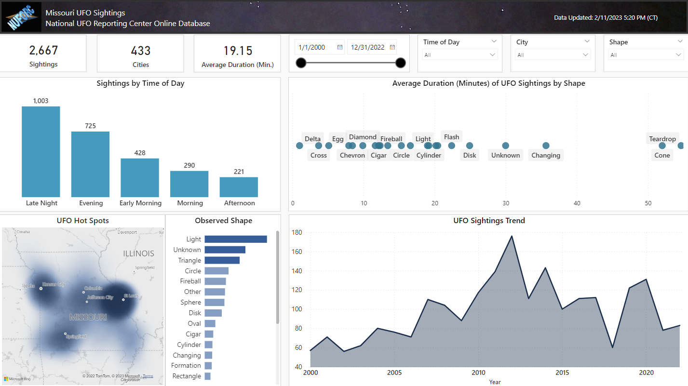
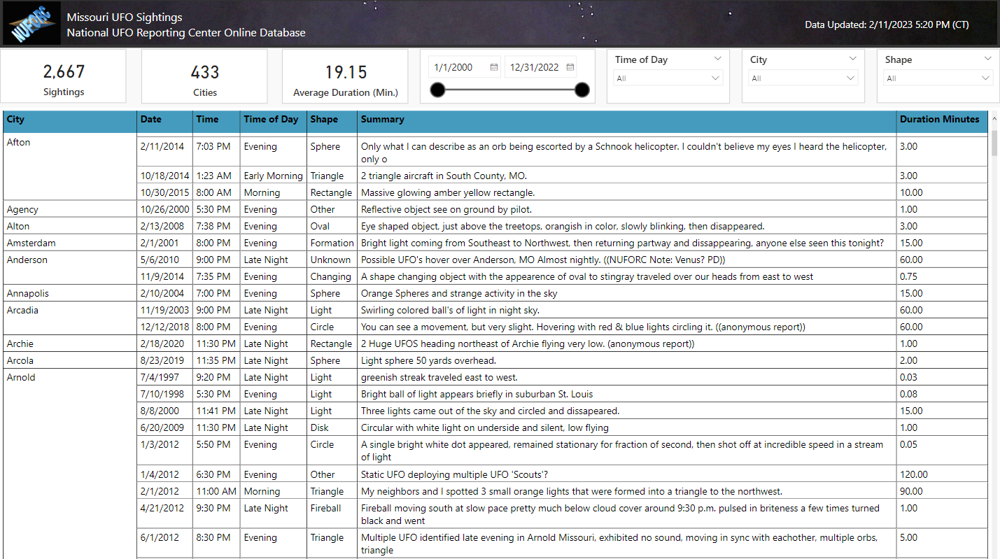

# Missouri UFO Sightings Dashboard  
A Power BI report built on data from [National UFO Reporting Center]( https://nuforc.org/)  
Created 2/18/23  

#### Dashboard:  
  

#### Detail View:
  

## Overview:
This project was completed as a demonstration of a typical report that I would create professionally ...  

#### Dashboard:
The Dashboard presents visualizations for ...

Summary Cards:  
- Total Sightings
- Total Cities with Sightings
- Average Duration for All Sightings

Charts:  
- Sightings by Time of Day
    - This column chart summarizes the sightings by time of day (morning, afternoon, evening, overnight). 
- Average Duration of UFO Sightings by Shape
    - This scatter chart visualizes the average duration of sightings, broken out by the observed shape of the UFO.
- UFO Hot Spots
    - This heat map allows the user to observe areas with greater propensities for sightings.
- Observed Shape
    - This bar chart provides insight into the shapes most frequently reported. Categories in dark blue represent the top 50% of sightings.
- UFO Sightings Trend 
    - This line chart visualizes sightings over time.  The user can also drill down to view the chart by month.

Slicers:  
- Timeframe (year, month)
- Time of Day (morning, afternoon, evening, overnight)
- City
- Shape

#### Report Detail:
The Report Detail page provides the detailed submission for each sighting.  

#### Development Approach:

#### Enhancement Opportunities:
The following are areas for improvement with future updates:
- x

